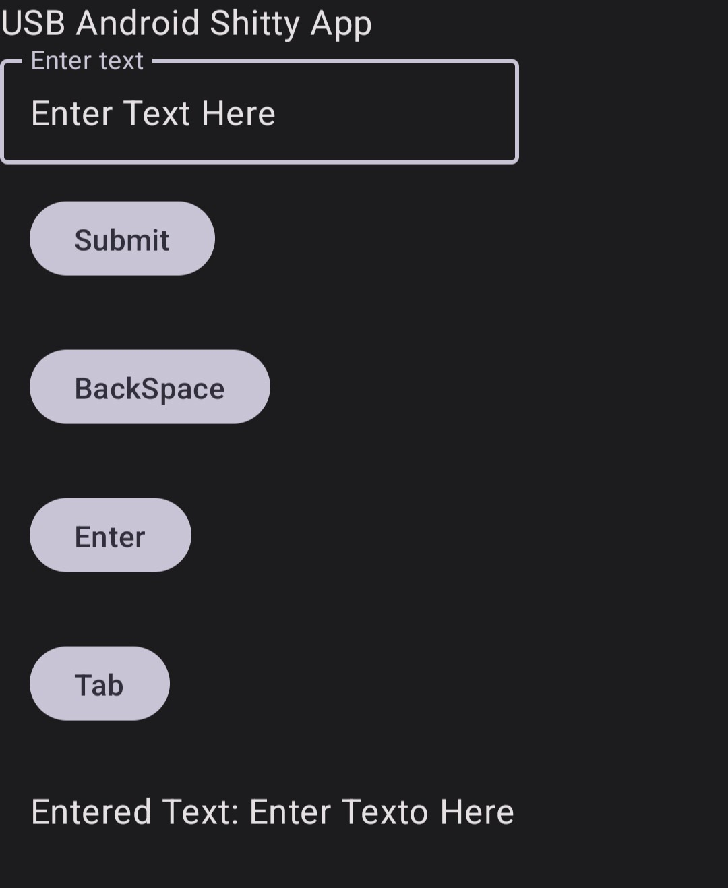

# USBAndroidKeyBoard
Barebones Android App that allows sending text and keypresses as USB Keyboard.

## ForeWord

This app is absolutely terrible at the moment.

This is built on top of [USB Gadget Tool](https://github.com/tejado/android-usb-gadget) and requires root access at the moment.

Most of the key backend code was taken from [Authorizer](https://github.com/tejado/Authorizer).

## How To Use

1. Enable a keyboard gadget inside [USB Gadget Tool](https://github.com/tejado/android-usb-gadget).
2. Open the app and type anything on the input area.

4. Click "Submit" to send the text to the connected device.

## TO DO: 
* try to make non root version by making /dev/hdgi0 writable
